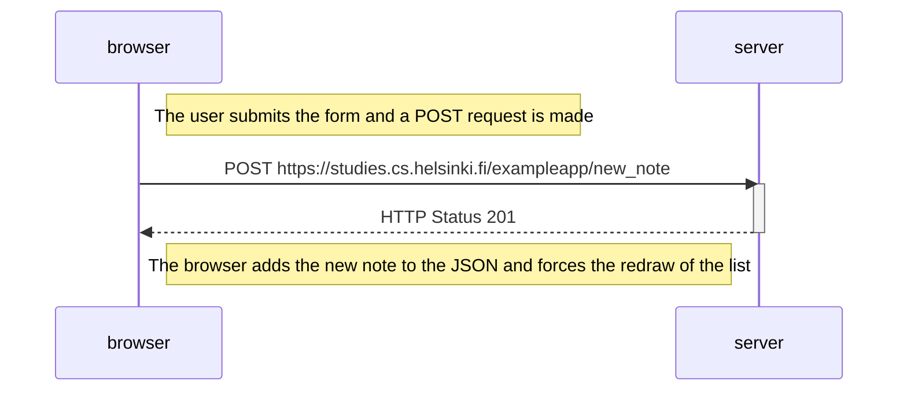

```mermaid
sequenceDiagram
    participant browser
    participant server

    Note right of browser: The user submits the form and a POST request is made

    browser->>server: POST https://studies.cs.helsinki.fi/exampleapp/new_note

    activate server
    server-->>browser: HTTP Status 201
    deactivate server

    Note right of browser: The browser adds the new note to the JSON and forces the redraw of the list
```
